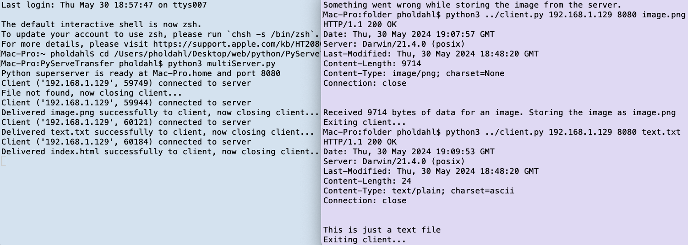

# PyServeTransfer



## Overview
This project consists of multiple Python scripts that together implement a simple HTTP server capable of handling multiple clients. 
The server can respond to HTTP GET requests, serving files and handling errors such as 404 Not Found. 
Additionally, a testing script is included to simulate multiple client requests.

## Table of Contents
- [Overview](#overview)
- [About the Project](#about-the-project)
- [Features](#features)
- [Current State and Future Development](#current-state-and-future-development)
- [Technology Used](#technology-used)
- [Dependencies](#dependencies)
- [Getting Started](#getting-started)
- [Usage](#usage)
- [Contributors](#contributors)
- [License](#license)

## About the Project
This project was originally based on a mandatory assignment in [Networking and Cloud Computing](https://student.oslomet.no/studier/-/studieinfo/emne/DATA2410/2022/H%C3%98ST) at OsloMet. 
However, it goes beyond the initial requirements, adding features such as the ability to transfer images and the creation of a test script. 
The goal was to implement a basic HTTP server and client to handle file requests and responses.

## Features
- **Single-threaded server:** Handles one client at a time (soloServer.py).
- **Multi-threaded server:** Handles multiple clients simultaneously (multiServer.py).
- **Client:** Sends GET requests to the server and handles responses (client.py).
- **Image transfer:** Supports transferring image files.
- **Testing script:** Simulates multiple client requests to test server performance (multiTester.py).

## Current State and Future Development
Currently, the project implements the core functionality of handling HTTP GET requests and serving static files. 
Future development could include:
- Adding support for more HTTP methods (e.g., POST, DELETE).
- Improving error handling and logging.
- Expanding the client script to handle additional response types.
- Enhancing security features.

## Technology Used
- **Python:** The main programming language used for implementing the server and client.
- **Socket Programming:** For handling network communication.
- **Threading:** For managing multiple clients concurrently.
- **Multiprocessing:** For simulating multiple client requests in the testing script.

## Dependencies
- `charset-normalizer`: Used to detect the encoding format of requested files.

## Getting Started

### Prerequisites
Ensure you have Python installed on your system. You can install the required libraries using pip:
```sh
  pip install charset-normalizer
```
### Running the Single-Threaded Server

1. **Start the solo server:**
```sh
  python soloServer.py
```

2. **Run the client to make a request:**
```sh
  python client.py <server_host> <server_port> <filename>
```

### Running the Multi-Threaded Server

1. **Start the multi-threaded server:**
```sh
  python multiServer.py
```

2. **Run the client to make a request:**
```sh
  python client.py <server_host> <server_port> <filename>
```

### Running the Multi-Tester

1. **Ensure the server is running (either soloServer.py or multiServer.py).**

2. **Run the multi-tester:**
```sh
  python multiTester.py
```

## Usage

### soloServer.py

A single-threaded HTTP server that handles one client at a time. 
It reads the incoming request, checks if the requested file exists, and responds with the file's content or a 404 Not Found message.

### multiServer.py
A multi-threaded HTTP server that can handle multiple clients simultaneously. 
It uses Python's threading module to create a new thread for each incoming client request.

### multiTester.py
A script to test the server's ability to handle multiple client requests simultaneously. 
It uses Python's multiprocessing module to simulate a large number of clients making requests to the server.

### client.py
A simple HTTP client that can send GET requests to the server. 
It can handle text and image files, displaying the response header and content or saving the image to disk.

## Contributors
- This project was developed solely by me [pholdahl](https://github.com/pholdahl).

## License
This project is licensed under the MIT License.

